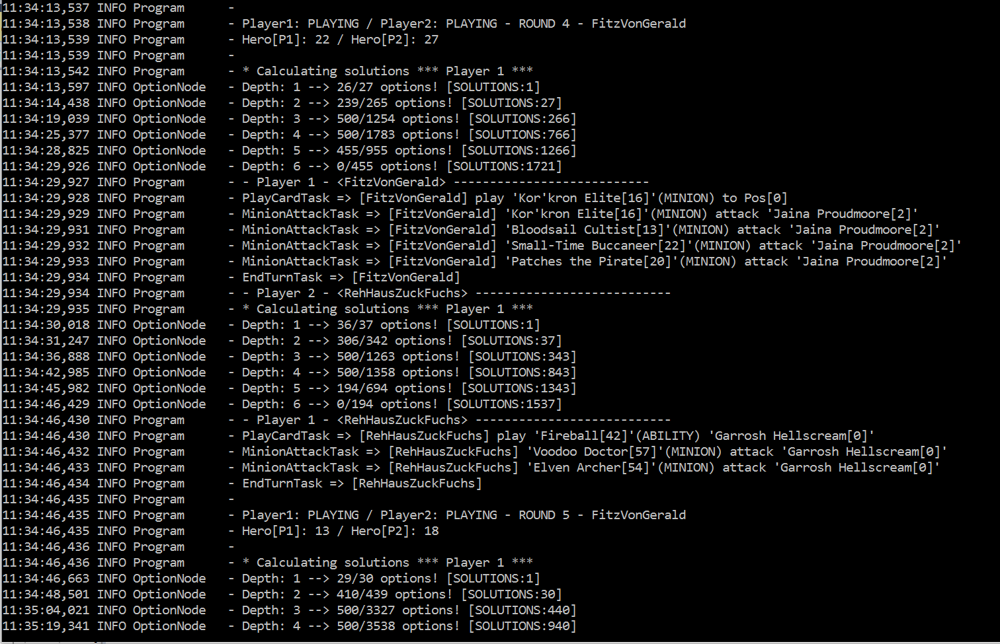

# Simple A.I.
> Small project about how to write a A.I. for Hearthstone using HsProtoSim.

[![NPM Version][npm-image]][npm-url]
[![Build Status][travis-image]][travis-url]
[![Downloads Stats][npm-downloads]][npm-url]



One to two paragraph statement about your product and what it does.
Simple A.I. is using **HsProtoSim**, which I created for simulation purpose,
currently there more less all basic cards implemented and some classics.

I changed my working focus concerning card implementation on the current
meta game decks (http://metastats.net/), so it is more uptodate for ai use.

Need more **human ressources** ... feel free to contact me.

**Example:**

* Playing Maelstrom and Spell definition code


## Quick Play

... create a Game ... 
```sh
            var game = new Game(new GameConfig
            {
                StartPlayer = 1,
                Player1HeroClass = CardClass.SHAMAN,
                Player2HeroClass = CardClass.SHAMAN,
                FillDecks = true
            });
```
... start ...
```sh
            game.StartGame();
```
... play ...          
```sh
            for(var i = 0; i < turns; i++)
            {
                var options = game.Options(game.CurrentPlayer);
                var option = options[rnd.Next(options.Count)];
                game.Process(option);
            }
```

## Installation

Windows:

```sh
check-out the project
run Programm.cs 
```

## Usage example

not uploaded right now ... comming soon ... (The test Example is using the Pirate Warrior Deck vs. Shaman Aggro Deck (Season 2017 Jan.))

### Game Configuration

```sh
new GameConfig
{
		// if not set it will choose randomly
		StartPlayer = 1, 				
							  
		// ... self-explaining
		Player1Name = "FitzVonGerald",
		  
		// ... self-explaining    
		Player1HeroClass = CardClass.MAGE, 
		
		// add a specific Deck to the player 
		DeckPlayer1 = new List<Card>()      
		{
				// add the Card "Mirror Image" to the deck
				Cards.FromName("Mirror Image"), 
		},
		
		// ... self-explaining
		Player2Name = "RehHausZuckFuchs",
		
		// ... self-explaining   
		Player2HeroClass = CardClass.MAGE,	
		
		DeckPlayer2 = new List<Card>()
		{
				// add the Card "Frostbolt" to the deck
				Cards.FromName("Frostbolt"),    
		},
		
		// game rule for decks standard and wild
		GameRule = FormatType.FT_STANDARD,  
		
		// if yes will fill the decks to have at least
		// 30 cards matching the game rule set
		FillDecks = false,	
										
		// if yes will shuffle decks before play					
    Shuffle = false,			
    
    // not implemented right now ...				   		
    DrawPool = false,				
    
    // work in progress, if a game can split during			
    // a player move ex. mad bomber or loot hoarder			
    Splitting = false										
    																		
    
}
```

#### A.I


## Development setup

tbd

## Release History

* 0.0.1
    * Work in progress

## Meta

darkfriend77 – [@RoxOnTox](https://twitter.com/dbader_org) – darkfriend@swissonline.ch

Distributed under the XYZ license. See ``LICENSE`` for more information.

[https://github.com/darkfriend77/SimpleAi](https://github.com/)

[npm-image]: https://img.shields.io/npm/v/datadog-metrics.svg?style=flat-square
[npm-url]: https://npmjs.org/package/datadog-metrics
[npm-downloads]: https://img.shields.io/npm/dm/datadog-metrics.svg?style=flat-square
[travis-image]: https://img.shields.io/travis/dbader/node-datadog-metrics/master.svg?style=flat-square
[travis-url]: https://travis-ci.org/dbader/node-datadog-metrics

... there is a lot more ... but no time need to code ^^

thx to this project which inspired me a lot ... and was a great base of solutions ...

https://github.com/HearthSim/Brimstone
